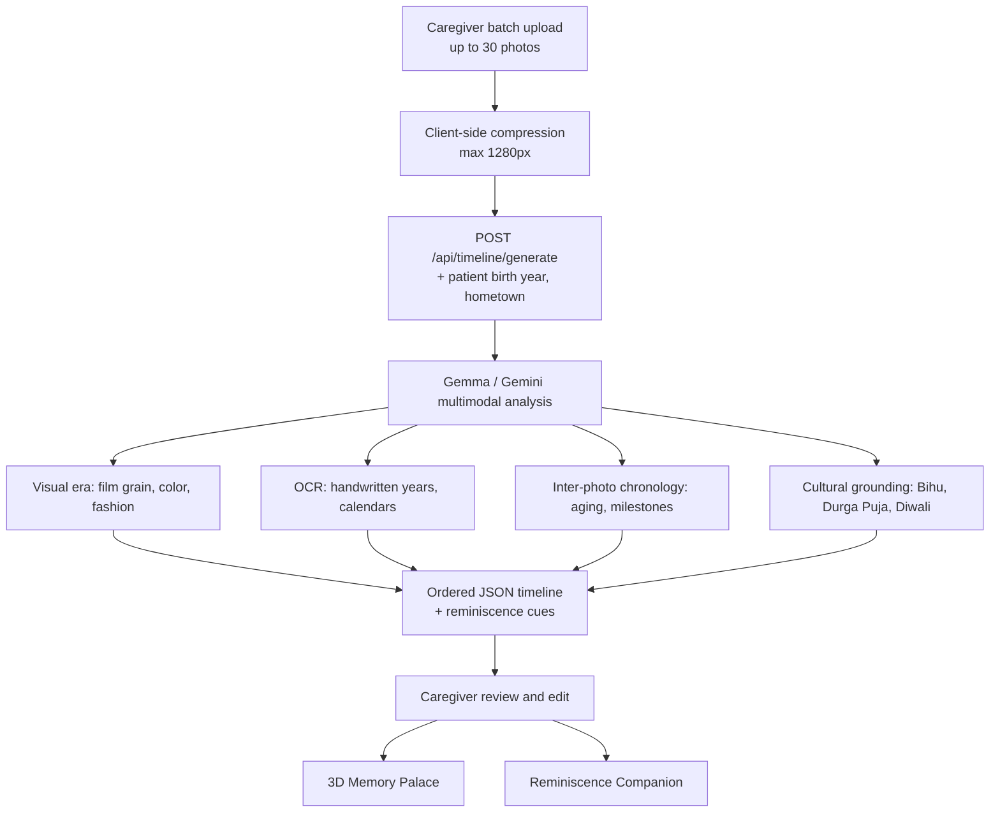
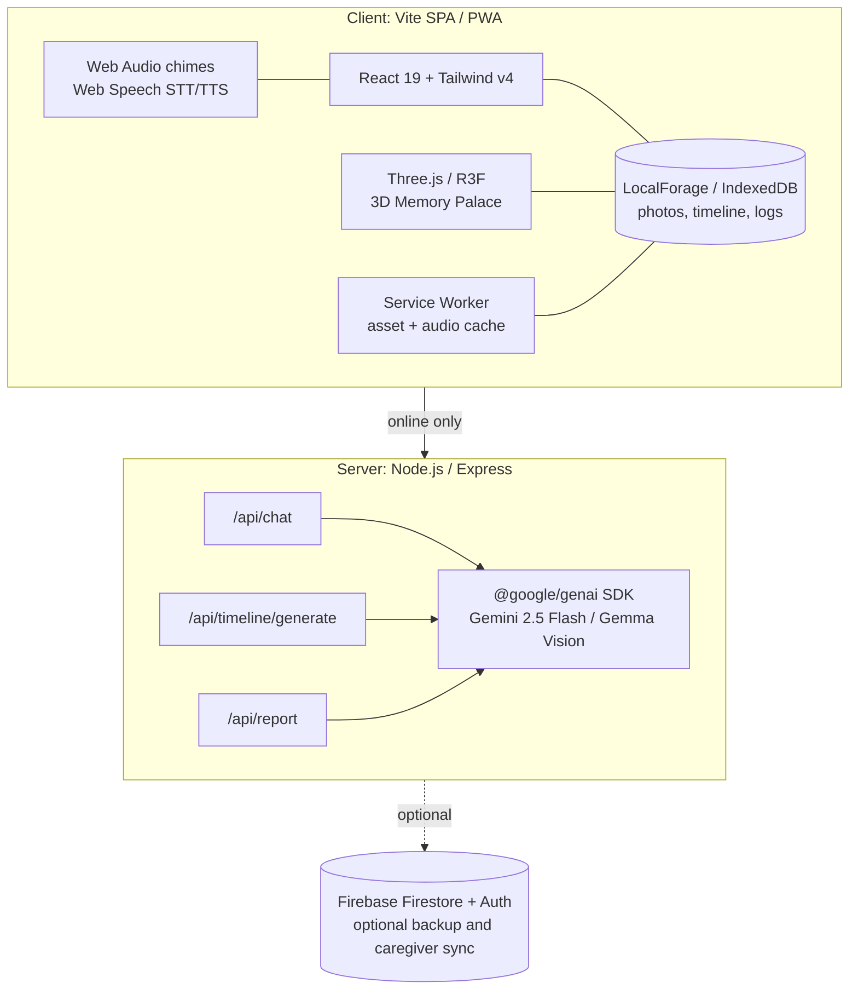

<div align="center">

# 🌿 SMARAN

### A dual-faced cognitive rehabilitation sanctuary and daily habit loop for dementia care

**Remember. Relive. Reconnect.**


*An offline-first, culturally anchored therapy platform that slows dementia progression through gentle gamified habits, family-prescribed sessions, and AI-synthesized photo timelines.*

[Demo](#-demo) · [Features](#-features) · [Architecture](#-architecture) · [Quick Start](#-quick-start) · [API](#-api-reference) · [Roadmap](#-roadmap)

</div>

---

## 📖 Table of Contents

- [The Problem](#-the-problem)
- [Our Approach](#-our-approach-rehabilitation-not-testing)
- [Features](#-features)
- [How We Use Gemma](#-how-we-use-gemma)
- [Tech Stack](#-tech-stack)
- [Lifeline: Gemma Photo Timeline Engine](#-lifeline-gemma-photo-timeline-engine)
- [Daily Quests](#-daily-quests)
- [Architecture](#-architecture)
- [Data Models](#-data-models)
- [API Reference](#-api-reference)
- [Privacy and Disclaimer](#-privacy-and-clinical-disclaimer)
- [Quick Start](#-quick-start)
- [Roadmap](#-roadmap)
---

## 🎬 Demo


|

| 
 

🔗 **Live demo:** https://smaran-j24q.vercel.app/
---

## 💔 The Problem

Over **55 million people** live with dementia worldwide. In multi-generational households across South Asia and other regions, specialized memory-care institutions are scarce or culturally resisted, so families carry the burden at home.

Most digital cognitive tools fail these families because they are:

1. **Diagnostic and stressful.** Pass/fail tests (MMSE, MoCA-style) can trigger distress and agitation.
2. **Culturally alien.** Westernized icons and abstract logic puzzles have no link to the senior's lived experience.
3. **One-sided.** Either the patient is left alone with the app, or caregivers must supervise constantly.

## 🌱 Our Approach: Rehabilitation, Not Testing

SMARAN borrows the **Duolingo habit loop** and replaces scoring and failure with warmth and continuity.

| Traditional memory apps | SMARAN |
| :--- | :--- |
| Pass/fail scores ("You scored 14/30") | Celebrates effort and streaks ("5-day morning streak! You lit today's Diya") |
| Dense menus, passwords, tiny buttons | One primary action per screen, voice guidance, zero login |
| Generic shapes and chess pieces | Culturally grounded motifs: Gamosa, Jaapi, Kopou Phool, family photos |
| Red buzzers and game-over screens | No fail state: soft hints, gentle chimes, unlimited calm retries |
| Patient plays alone | Family configures quests and receives longitudinal insights |

### The Daily Loop

1. **Cue:** At 8:00 AM a temple chime and localized voice greeting begin the morning.
2. **Routine:** Three bite-sized quests of 3-5 minutes each (orientation, motif match, photo reminiscence).
3. **Reward:** Light a virtual Diya, unlock a node in the 3D palace, grow the streak.
4. **Outcome:** Consistent, stress-free cognitive stimulation and a stable daily rhythm that helps reduce apathy and evening agitation.

---

## ✨ Features

SMARAN is **one app with two faces** sharing a single local-first data layer.

### 👵 Face A: Patient Sanctuary

Designed for mild cognitive impairment through moderate dementia (FAST stages 3-5).

- **Frictionless access:** launch from a PWA home-screen icon or a scheduled notification, no passwords.
- **Physical ergonomics:** 56px+ touch targets, contrast above 7:1, warm paper background (`#faf8f5`) to cut glare.
- **Cognitive ergonomics:** flat bottom-dock navigation, icon + plain-language labels, text-to-speech on every item (English, Hindi, Assamese, and more).
- **One-touch family call:** a large, calming "Call Daughter / Son" button with visual confirmation.

### 👨‍👩‍👧 Face B: Family and Caregiver Command Center

- **Quest prescription:** choose which quests run each day and tune difficulty (grid size, sequence speed, snooze length).
- **Care routines:** medication alarms plus circadian anchors (morning sunlight, hydration, evening tea, Sandhya lamp lighting).
- **Photo uploader:** batch-upload up to 30 family photos, then review and edit AI-generated dates and captions before publishing.
- **Telemetry and reports:** track hesitation time, sequence length, and completion consistency, and export a progress report for the patient's neurologist.

---

## 🤖 How We Use Gemma

Gemma is the multimodal core of SMARAN's **Lifeline** engine. It looks at a caregiver's pile of unlabeled family photos and reasons about *when* and *what* each one shows, so the patient sees a calm, ordered life story instead of a jumble.

| Where | Model | What it does | Why it fits |
| :--- | :--- | :--- | :--- |
| **Lifeline timeline** (`/api/timeline/generate`) | **Gemma multimodal vision** | Estimates year and decade per photo, detects people, reads handwritten dates (OCR), grounds festivals and clothing in cultural context, orders the whole batch | Needs image + text reasoning across many photos at once |
| **Reminiscence cues** | **Gemma** (inside the same call) | Writes one gentle, open-ended, non-threatening question per photo | Cues stay tied to what is actually in the picture |
| **Reminiscence Companion** (`/api/chat`) | Gemini 2.5 Flash | Conversational therapy grounded in the family's memories | Low-latency, empathetic chat |
| **Progress report** (`/api/report`) | Gemini 2.5 Flash | Summarizes telemetry into a clinician-friendly report | Long-context summarization |

### What Gemma reasons over

1. **Visual era analysis:** film grain, black-and-white vs. sepia vs. color saturation, print style.
2. **OCR and artifacts:** handwritten years on the photo, wall calendars, signage.
3. **Cross-photo chronology:** facial aging of the same relatives, children's growth milestones.
4. **Cultural grounding:** attire (e.g. Muga silk Mekhela Chador), festivals (Bihu, Durga Puja, Diwali), settings (tea gardens, courtyards).
5. **Caregiver hints:** patient birth year and hometown narrow the estimate.

### How the call is configured

- **Low temperature (`0.2`)** for consistent, factual dating.
- **Structured JSON output** (`responseMimeType: application/json`), so the timeline drops straight into the UI.
- **A confidence score per photo.** Low-confidence entries are flagged for the caregiver.
- **Human in the loop:** the caregiver reviews and edits every date and caption before the patient sees it.
---

## 🧰 Tech Stack

| Layer | Technologies |
| :--- | :--- |
| **Frontend** | React 19, Vite, Tailwind CSS v4 |
| **3D** | Three.js with React Three Fiber (Memory Palace) |
| **Offline / PWA** | Service Worker, LocalForage (IndexedDB), installable PWA |
| **Audio and voice** | Web Audio API (chimes, reminders), Web Speech API (speech recognition and synthesis) |
| **Backend** | Node.js 20+, Express |
| **AI** | Google **Gemma** (multimodal vision), **Gemini 2.5 Flash**, `@google/genai` SDK |
| **Cloud (optional)** | Firebase Firestore and Authentication for backup and caregiver sync |
| **Language** | JavaScript / TypeScript |

## 🧬 Lifeline: Gemma Photo Timeline Engine

Unordered photos cause temporal disorientation. **Lifeline** reconstructs a gentle, chronological autobiography from a pile of family pictures.

### Why chronology matters

Per **Ribot's Law**, recent memories fade first while remote memories from youth (the "reminiscence bump", roughly ages 10-30) persist longest. Lifeline arranges photos accordingly:

| Layer | Purpose |
| :--- | :--- |
| **Roots** (childhood, early years) | Builds safety and identity |
| **Anchor** (family formation) | Connects emotional bonds to home and children |
| **Bridge** (later years, grandchildren) | Links remote memories to the present |

### Pipeline



### Output contract

```json
{
  "timeline": [
    {
      "estimatedYear": 1974,
      "estimatedDecade": "1970s",
      "title": "Wedding Blessing",
      "description": "Ivory and gold Muga silk Mekhela Chador with red floral borders, surrounded by family.",
      "keyPeopleDetected": ["Patient (Bride)", "Groom", "Elder Matriarch"],
      "culturalContext": "Assamese Traditional Wedding Ceremony",
      "reminiscenceCue": "Do you remember the fragrance of the Kopou Phool in your hair that day?",
      "confidenceScore": 0.92
    }
  ]
}
```

> Year estimates are AI suggestions. The caregiver always reviews and corrects them before the patient sees anything.

---

## 🎮 Daily Quests
| # | Module | Clinical rationale | What the patient does |
| :-: | :--- | :--- | :--- |
| 1 | **Orientation and Circadian Anchoring** (8:00 AM) | Circadian disruption is common in dementia and linked to evening agitation | Chime, greeting, weather and medication check-in |
| 2 | **Motif Match** | Visual recognition and pattern memory | Match culturally familiar pairs (Kaziranga rhino 🦏, Gamosa 🧣, Kopou Phool 🌸, Jaapi 👒, Dhol and Pepa 🪕). Starts at 4 cards, grows to 6 and 8 |
| 3 | **Sequence Memory** | Working memory and auditory retention | Repeat pulsing icon and chime sequences, no time penalty |
| 4 | **3D Memory Palace** | Method of Loci uses relatively preserved spatial memory | Walk through a 3D home (Three.js), placing glasses, prayer bell, and keys on familiar surfaces |
| 5 | **Reminiscence Companion** | Reminiscence and validation therapy | Chat with a Gemini-powered persona grounded in the family's memories and local vocabulary |

---

## 🏗 Architecture

Built for intermittent connectivity and power cuts.



---

## 🗂 Data Models

<details>
<summary><b>Memory</b> (timeline node)</summary>

```typescript
interface Memory {
  id: string;
  objectId?: string;         // links to a 3D object in the Memory Palace
  image: string | null;      // base64 or local object URL
  description: string;
  date: number;              // epoch ms
  estimatedYear?: number;    // extracted by Gemma
  eraTitle?: string;
  keyPeople?: string[];
  reminiscenceCue?: string;
}
```
</details>

<details>
<summary><b>PrescribedQuest</b> (caregiver-configured task)</summary>

```typescript
interface PrescribedQuest {
  id: string;
  title: string;
  category: 'orientation' | 'motif' | 'sequence' | 'reminiscence' | 'ritual';
  difficulty: 'gentle' | 'moderate' | 'challenging';
  assignedTime: string;      // "08:00"
  completed: boolean;
  streakCount: number;
  icon: string;
}
```
</details>

<details>
<summary><b>CognitiveTelemetryEntry</b> (longitudinal tracking)</summary>

```typescript
interface CognitiveTelemetryEntry {
  id: string;
  timestamp: number;
  gameType: 'motif_match' | 'sequence_memory' | 'reminiscence';
  score: number;
  durationSeconds: number;
  hesitationTimeMs: number;
  accuracyRate: number;      // 0.0 - 1.0
  notes?: string;
}
```
</details>

---

## 🔌 API Reference

### `POST /api/chat`
Reminiscence conversation grounded in the patient's memories.

```json
// Request
{
  "prompt": "I was looking at the old photo of Bihu celebrations.",
  "persona": "therapist",
  "memories": [{ "id": "m1", "description": "Family Bihu feast", "date": 1618358400000 }],
  "activities": []
}

// Response
{
  "text": "The rhythm of the Dhol and Pepa brings so much warmth. Did you enjoy making Pitha together?",
  "attachedImage": null
}
```

### `POST /api/timeline/generate`
Builds an ordered Lifeline from uploaded photos.

```json
// Request
{
  "images": [
    { "id": "img1", "base64": "data:image/jpeg;base64,...", "hint": "Wedding day" },
    { "id": "img2", "base64": "data:image/jpeg;base64,...", "hint": "Tea garden visit" }
  ],
  "patientBio": { "birthYear": 1952, "hometown": "Jorhat, Assam" }
}

// Response
{
  "timeline": [
    {
      "id": "img1",
      "estimatedYear": 1975,
      "title": "Wedding in Jorhat",
      "description": "Joyous wedding ceremony adorned in Muga silk.",
      "reminiscenceCue": "Can you recall who sang the Biyanaam wedding songs?"
    }
  ]
}
```

### `POST /api/report`
Turns telemetry into a summary report for the patient's clinician.

```json
// Request
{ "patientName": "Grandmother Ananya", "patientAge": 74, "activities": [], "conversations": [] }

// Response
{ "report": "# Cognitive Activity & Progression Report\n..." }
```

---

## 🔒 Privacy and Clinical Disclaimer

### Privacy principles

- **Local-first storage:** photos, voice recordings, and conversation history are kept on the device in IndexedDB.
- **What leaves the device:** when a caregiver uses AI features (timeline generation, chat, reports), the relevant content is sent through the SMARAN server to the Gemini API for processing. Optional Firebase sync is opt-in.
- **No training use:** patient data is not used by SMARAN to train models. Review your Google API data-usage terms for your chosen tier.
- **No trackers:** no ad pixels, third-party analytics, or social-sharing SDKs.

### ⚠️ Medical notice

> SMARAN is an assistive digital therapy and caregiver coordination tool offering non-pharmacological cognitive stimulation, circadian anchoring, and reminiscence therapy. It **does not diagnose** any condition and is **not a substitute** for professional evaluation (MRI, PET, clinical MMSE/MoCA). Always consult a qualified geriatric physician about treatment and medication.

---

## 🚀 Quick Start

### Prerequisites

- Node.js **20+**
- A modern browser with Web Audio and WebGL
- A Google Gemini API key ([get one here](https://aistudio.google.com/apikey))

### Install and run

```bash
# 1. Clone
git clone https://github.com/<your-username>/smaran-firefly-ai.git
cd smaran-firefly-ai

# 2. Install
npm install

# 3. Configure
cp .env.example .env
# edit .env and set: GEMINI_API_KEY="your-gemini-api-key"

# 4. Develop (Vite + Express on http://localhost:3000)
npm run dev

# 5. Production build
npm run build
npm start
```

> 🔐 Never commit your `.env` file. Make sure it is listed in `.gitignore`.

---

## 🗺 Roadmap

- [ ] More regional languages and dialect-aware voice guidance
- [ ] Fully on-device Gemma inference for offline AI features
- [ ] Caregiver mobile companion with push alerts
- [ ] Wearable and sleep-data integration for circadian insights
- [ ] Clinician-facing report templates
- [ ] Pilot studies with memory-care professionals

## 🙏 Acknowledgements

Built with reverence for elders living with memory loss and the families who care for them.

Powered by [Google Gemini / Gemma](https://ai.google.dev/) · [React](https://react.dev) · [Three.js](https://threejs.org) · [Vite](https://vitejs.dev)

<div align="center">

**🌿 Remember. Relive. Reconnect. 🌿**

</div>
